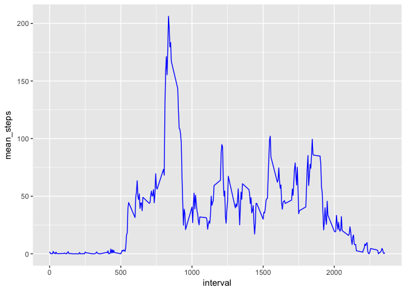
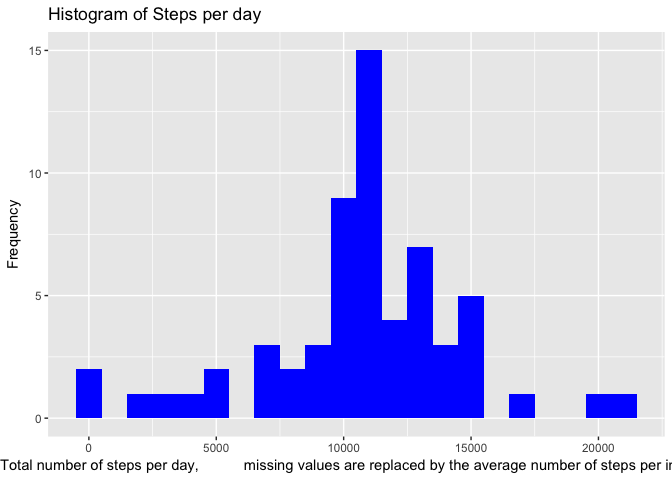
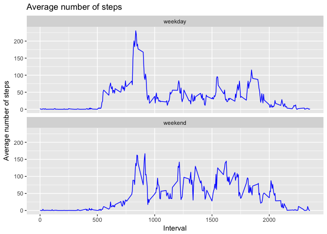

## Loading and preprocessing the data
Step 1: install packages that will be used later on

```r
library(lubridate)
```

```
## 
## Attaching package: 'lubridate'
```

```
## The following object is masked from 'package:base':
## 
##     date
```

```r
library(dplyr)
```

```
## 
## Attaching package: 'dplyr'
```

```
## The following objects are masked from 'package:lubridate':
## 
##     intersect, setdiff, union
```

```
## The following objects are masked from 'package:stats':
## 
##     filter, lag
```

```
## The following objects are masked from 'package:base':
## 
##     intersect, setdiff, setequal, union
```

```r
library(ggplot2)
```
Step 2: Load the dataset into R + clean it up a bit

```r
datasetFile <- "activity.csv"
data <- read.csv(datasetFile, header = TRUE, sep = ',', 
                 colClasses = c("numeric", "character", "integer"))

data$date <- ymd(data$date)
```


## What is mean total number of steps taken per day?

Step 1. Calculate the total number of steps per day (first subset data without missing values)

```r
##table for the data with missings included (but are considered as 0)
#summary1 <- group_by(data, date)
#table1 <- summarize(summary1, sum_steps = sum(steps,na.rm = TRUE))
subset <- filter(data, !is.na(data$steps))
summary1 <- group_by(subset,date)
table1 <- summarize(summary1,sum_steps = sum(steps,na.rm = TRUE))
```

Step 2. Make a histogram of the total number of steps taken each day
missing values are excluded

```r
##plot for the data where NA are included (but are skipped)
#plot1 <- ggplot(table1, aes(x = sum_steps)) + geom_histogram(fill = "firebrick", 
#        binwidth = 1000) + labs(title = "Histogram of Steps per day", 
#        x = "Steps per day", y = "Frequency")

plot1 <- ggplot(table1, aes(x = sum_steps)) +
        geom_histogram(fill = "blue", binwidth = 1000) +
        labs(title = "Histogram of steps per day", x = "Total number of steps per day", 
                y = "Frequency")
plot1
```

<!-- -->

Step 3. Calculate the mean and median of the total number of steps taken per day:

```r
mean_steps <- mean(table1$sum_steps, na.rm = TRUE) 
median_steps <- median(table1$sum_steps, na.rm = TRUE)
mean_steps
```

```
## [1] 10766.19
```

```r
median_steps
```

```
## [1] 10765
```

## What is the average daily activity pattern?

Step 1. Make a time series plot (i.e. type = "l") of the 5-minute interval (x-axis) and the average number of steps taken, averaged across all days (y-axis)

```r
summary2 <- group_by(subset,interval)
table2 <- summarize(summary2,mean_steps = mean(steps,na.rm = TRUE))

plot2 <- ggplot(table2, aes(x=interval, y=mean_steps)) +
  geom_line(color = "blue")
plot2
```

<!-- -->

Step 2. Which 5-minute interval, on average across all the days in the dataset, contains the maximum number of steps?

```r
table2[which.max(table2$mean_steps),]
```

```
## # A tibble: 1 x 2
##   interval mean_steps
##      <int>      <dbl>
## 1      835   206.1698
```


## Imputing missing values

Note that there are a number of days/intervals where there are missing values (coded as NA). The presence of missing days may introduce bias into some calculations or summaries of the data.

Step 1. Calculate and report the total number of missing values in the dataset (i.e. the total number of rows with NAs)

```r
sum(is.na(data$steps))
```

```
## [1] 2304
```

Step 2. Devise a strategy for filling in all of the missing values in the dataset. The strategy does not need to be sophisticated. For example, you could use the mean/median for that day, or the mean for that 5-minute interval, etc.
Step 3. Create a new dataset that is equal to the original dataset but with the missing data filled in.
Here we imputed missing values where missing values are replaced by an average number of steps in that interval


```r
data_imputed <- data 
nas <- is.na(data_imputed$steps) 
avg_interval <- tapply(data_imputed$steps, data_imputed$interval, mean, na.rm=TRUE,  simplify=TRUE) 
data_imputed$steps[nas] <- avg_interval[as.character(data_imputed$interval[nas])]
```

Step 4. Make a histogram of the total number of steps taken each day and Calculate and report the mean and median total number of steps taken per day. Do these values differ from the estimates from the first part of the assignment? What is the impact of imputing missing data on the estimates of the total daily number of steps?

```r
summary3 <- group_by(data_imputed,date)
table3 <- summarize(summary3,sum_steps = sum(steps,na.rm = TRUE))
plot3 <- ggplot(table3, aes(x = sum_steps)) +
        geom_histogram(fill = "blue", binwidth = 1000) +
        labs(title = "Histogram of Steps per day", x = "Total number of steps per day,           missing values are replaced by the average number of steps per interval", 
                y = "Frequency")
plot3
```

<!-- -->

```r
mean_steps3 <- mean(table3$sum_steps, na.rm = TRUE) 
median_steps3 <- median(table3$sum_steps, na.rm = TRUE)
mean_steps3
```

```
## [1] 10766.19
```

```r
median_steps3
```

```
## [1] 10766.19
```


## Are there differences in activity patterns between weekdays and weekends?

For this part the weekdays() function may be of some help here. Use the dataset with the filled-in missing values for this part.

Step 1. Create a new factor variable in the dataset with two levels – “weekday” and “weekend” indicating whether a given date is a weekday or weekend day.

```r
data_imputed$x <- weekdays(data_imputed$date, abbreviate = FALSE)
data_imputed$daytype <- "weekday"
data_imputed$daytype[data_imputed$x=="Saturday"] <- "weekend"
data_imputed$daytype[data_imputed$x=="Sunday"] <- "weekend"
data_imputed$daytype <- as.factor(data_imputed$daytype)
str(data_imputed)
```

```
## 'data.frame':	17568 obs. of  5 variables:
##  $ steps   : num  1.717 0.3396 0.1321 0.1509 0.0755 ...
##  $ date    : Date, format: "2012-10-01" "2012-10-01" ...
##  $ interval: int  0 5 10 15 20 25 30 35 40 45 ...
##  $ x       : chr  "Monday" "Monday" "Monday" "Monday" ...
##  $ daytype : Factor w/ 2 levels "weekday","weekend": 1 1 1 1 1 1 1 1 1 1 ...
```

Step 2. Make a panel plot containing a time series plot (i.e. type="l") of the 5-minute interval (x-axis) and the average number of steps taken, averaged across all weekday days or weekend days (y-axis). See the README file in the GitHub repository to see an example of what this plot should look like using simulated data.


```r
summary4 <- group_by(data_imputed,interval, daytype)
table4 <- summarize(summary4,mean_steps = mean(steps,na.rm = TRUE))

plot4 <- ggplot(table4, aes(x=interval, y=mean_steps)) +
        geom_line(color = "blue") + 
        facet_wrap(~daytype, ncol = 1, nrow=2) +
        labs(title = "Average number of steps",
        x = "Interval", 
        y = "Average number of steps")
plot4
```

<!-- -->
